


 

  
  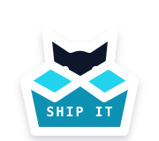
  

<em>The build crew — coding, shipping, and getting back to you.</em>

<h2 align="center">I build the useful part.</h2>

I am Chris, a second-year IT student and solutions developer based in the Philippines. I build practical software for people who have work to finish: websites that establish credibility, business systems that replace manual tracking, and automation that gives time back.


<em>The framework is a tool. The outcome is the point.</em>


<h2 align="center">Selected work</h2>

  <a href="https://frontend-eta-nine-70.vercel.app"></a>
  <a href="https://github.com/mightbechr1s/SKILLSYNC"></a>
   
  <a href="https://mightbechr1s.github.io/STOCKFLOW/"></a>
  <a href="https://mightbechr1s.github.io/Chronicle/"></a>

<strong>Project details and source links</strong>

- **Yield** — Pantry-to-recipe cooking application · [Live demo](https://frontend-eta-nine-70.vercel.app) · [Source](https://github.com/mightbechr1s/yield)
- **SkillSync** — Student project coordination desktop app · [Source](https://github.com/mightbechr1s/SKILLSYNC)
- **StockFlow** — Inventory and sales management · [Live demo](https://mightbechr1s.github.io/STOCKFLOW/) · [Source](https://github.com/mightbechr1s/STOCKFLOW)
- **Chronicle** — Photo stories and shared timelines · [Live demo](https://mightbechr1s.github.io/Chronicle/) · [Source](https://github.com/mightbechr1s/Chronicle)





