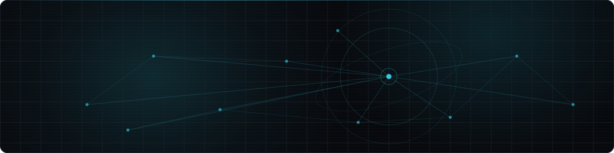
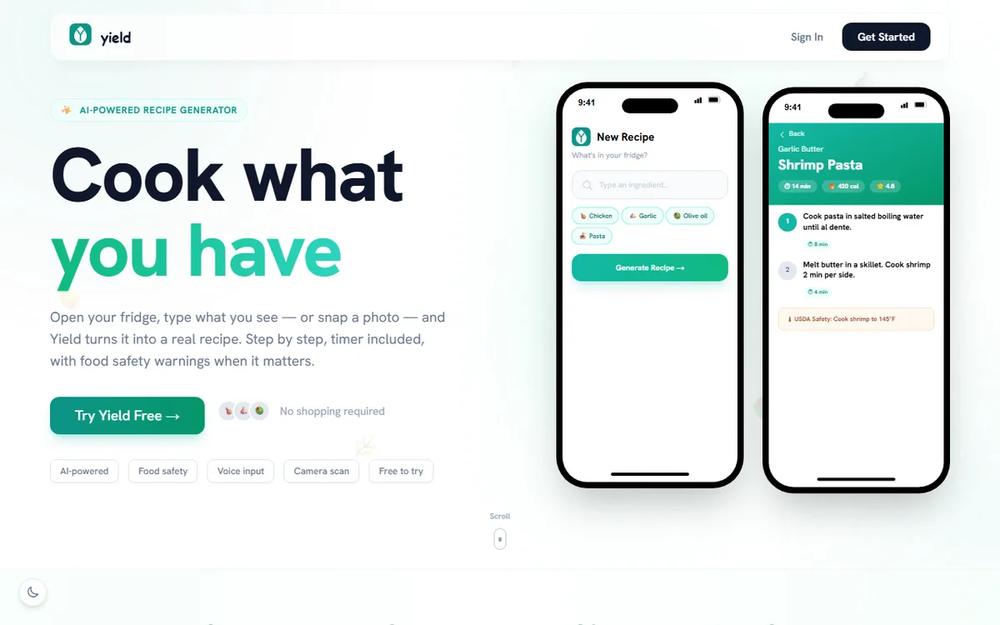
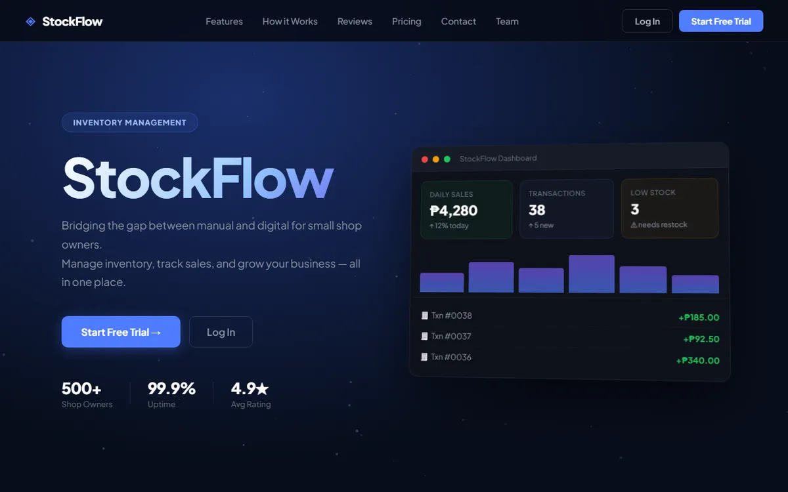
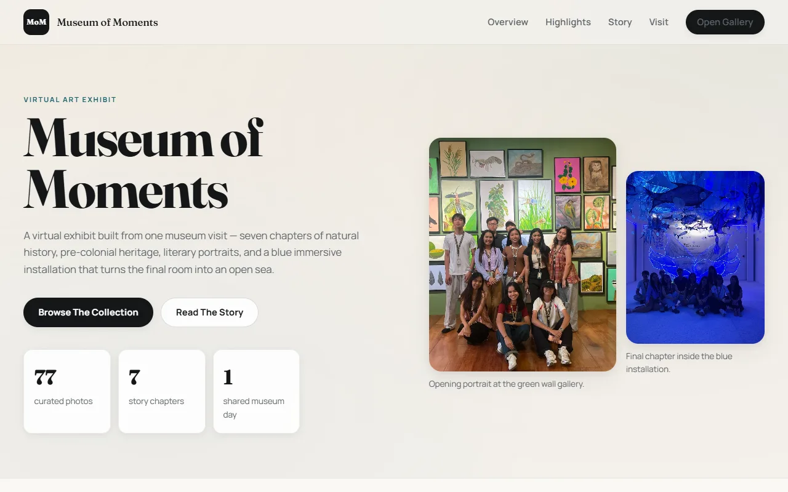

# CHRIS

**IT STUDENT · DEVELOPER · BUILDER**

### "I build the useful part."

[Portfolio](https://mightbechr1s.github.io/portfolio/) · [GitHub](https://github.com/mightbechr1s) · [LinkedIn](https://linkedin.com/in/cw-webster-ba7266425) · [Email](mailto:chrismakesweb@gmail.com)

## About

I'm Chris — a second-year IT student from the Philippines focused on building practical software and learning by shipping real projects.

I work on web applications, business systems, AI-powered applications, automation, and small tools for students. Most of what I know, I know because something needed building and I went and built it.

> The framework is a tool. The outcome is the point.

> I'm still learning, but I believe the best way to improve is to build, experiment, break things, and ship.

## Currently Building

| FOCUS | WHAT THAT LOOKS LIKE |
|:---|:---|
| **WEB DEVELOPMENT** | Practical web applications that people can actually use. |
| **AI + AUTOMATION** | Useful AI integrations and workflows that give time back. |
| **SOFTWARE SYSTEMS** | Tools built around real-world workflows, not demo data. |
| **UI / UX** | Simple, useful, polished interfaces. |

## Tech Stack

| | |
|:---|:---|
| **Languages** | `Python` · `Java` · `JavaScript` · `TypeScript` · `HTML` · `CSS` |
| **Tools & Technologies** | `React` · `Node.js` · `Git` · `GitHub` · `VS Code` · `Vercel` · `GitHub Pages` · AI APIs |

Technologies I use, explore, and am still learning — not a claim of expertise.

## Selected Work

### YIELD

**AI-powered cooking application**

Turns available ingredients into practical recipes with AI-powered recommendations and guided cooking.

| Built with | Links |
|:---|:---|
| `TypeScript` · `React` · AI APIs | [Live Demo →](https://frontend-eta-nine-70.vercel.app/) · [Source Code →](https://github.com/mightbechr1s/yield) |

### STOCKFLOW

**Inventory & sales management system**

A practical system designed to help businesses manage inventory, point-of-sale operations, receipts, and analytics.

| Built with | Links |
|:---|:---|
| `JavaScript` · `HTML` · `CSS` | [Live Demo →](https://mightbechr1s.github.io/STOCKFLOW/) · [Source Code →](https://github.com/mightbechr1s/STOCKFLOW) |

### SKILLSYNC

**Student project coordination system**

A desktop application designed around organizing student projects, collaboration, and workflow management.

| Built with | Links |
|:---|:---|
| `Java` | [Source Code →](https://github.com/mightbechr1s/SKILLSYNC) |

### CHRONICLE

**Photo stories & shared timelines**

A web experience focused on preserving moments through photos, stories, and chronological timelines.

| Built with | Links |
|:---|:---|
| `JavaScript` | [Live Demo →](https://mightbechr1s.github.io/Chronicle/) · [Source Code →](https://github.com/mightbechr1s/Chronicle) |

## What I'm Building Toward

I want my projects to be more than school demonstrations — software that holds up outside the classroom.

| | |
|:---|:---|
| **USEFUL** | Solves an actual problem. |
| **PRACTICAL** | Works in a real workflow. |
| **SIMPLE** | Easy to understand and use. |
| **SCALABLE** | Can grow beyond a school project. |
| **POLISHED** | Feels like a real product. |

## GitHub

This account holds the projects, the experiments, and the things I'm currently learning.

> Most of what you'll find here is me learning by building.

[**github.com/mightbechr1s**](https://github.com/mightbechr1s)

## Connect

If you're interested in collaborating, building something, or talking about tech, feel free to reach out.

| | |
|:---|:---|
| **Email** | [chrismakesweb@gmail.com](mailto:chrismakesweb@gmail.com) |
| **Portfolio** | [mightbechr1s.github.io/portfolio](https://mightbechr1s.github.io/portfolio/) |
| **GitHub** | [github.com/mightbechr1s](https://github.com/mightbechr1s) |
| **LinkedIn** | [linkedin.com/in/cw-webster-ba7266425](https://linkedin.com/in/cw-webster-ba7266425) |

**BUILD · LEARN · SHIP**

Still learning. Still building.

